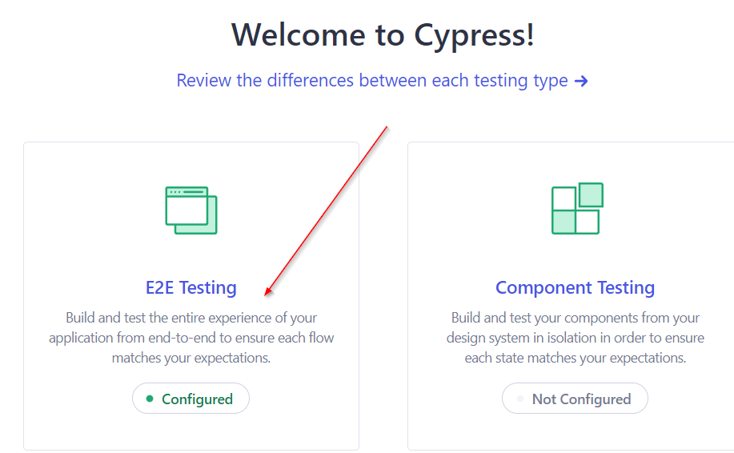
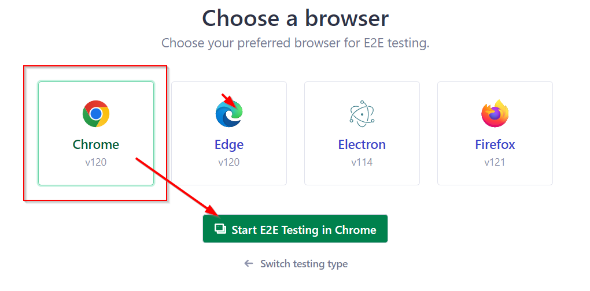
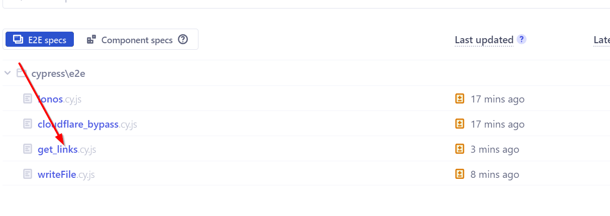

 <a href="https://codeclimate.com/github/ny-daystar/gudenaa/maintainability"></a>  


[](#contributors)


# Gudenaa

Cypress project to automate some actions.

Source code analysed with [DeepSource](https://deepsource.com/)

## Summary

-   [Requirements](#requirements)
-   [Get Started](#get-started)
-   [Debug](#debug)
    -   [Use Cypress UI](#use-cypress-ui)
    -   [Debug only one specification](#debug-only-one-specification)
-   [Configuration for get-links script](#configuration-for-get-links)
-   [For developpers](#for-developpers)
-   [Formatting](#formatting)
    -   [Setup Eslint](#setup-eslint)
    -   [Setup Prettier](#setup-prettier)
-   [Credits](#credits)

##### Version: 1.0.0

### Requirements

-   [NodeJS](http://nodejs.org) >= 20.3.1

## Get Started

1. Clone the repository

```bash
git clone https://github.com/NY-Daystar/Gudenaa.git
```

2. Install dependencies

```bash
npm install
```

3. Setup configuration file

```bash
cp config.sample.json config.json
```

> See [Configuration](#configuration-for-get-links) to complete config.json file

3. Execute cypress specs `get-links.cy.js`

```bash
npm run get-links
```

4. If normally executed you will get your file in the path configured in `config.json` file

## Debug

### Use Cypress UI

If you encounter problems you can debug the script like this :

1. run cypress UI

```bash
npm start
```

2. open E2E (end-to-end) specs
   

3. Select navigator among (Chrome, Edge, Firefox)
   
4. Select the script you want to debug (ex: `get-links.cy.js`)
   

> Each change of the file will reload the cypress spec

### Debug only one specification

Example with spec file : `/cypress/e2e/ionos.cy.js`:

```bash
npm run spec --file=ionos
```

If you are on `Windows``

```bash
npm run spec:win --file=ionos
```

## Configuration for get-links

This project needs several informations to be complete in `config.json` file

Here's information needed:

-   `url`: The url to scrap data
-   `selector`: The selector css in the dom of `url` page to extract links
-   `limit` : number of elements `to fetch` with `selector`
-   `offset` : number of beggining elements `to skip` with `selector`
-   `filePath`: csv filepath (relative path) where store data (**DO NOT PUT ABSOLUTE PATH**)

Exemple:

```json
{
    "url": "https://en.wikipedia.org/wiki/Peaky_Blinders_(TV_series)",
    "selector": ".mw-content-ltr.mw-parser-output > ul > li > a",
    "offset": "0",
    "limit": "0",
    "filePath": "results/peaky-blinder-characters.csv"
}
```

## For developpers

If you want to contribute and add new scripts, you need to place it at `cypress/e2e` folder

## Formatting

The source code is format with the `prettier`
The source code is validate with `eslint`

### Setup EsLint

1. Install module

```bash
npm install --save-dev eslint
npm i -D @stylistic/eslint-plugin-js
```

2. Init eslint and configure it

```bash
npm init @eslint/config
# Setup: `To check syntax and find problems`
```

> BE CAREFUL setup only `To check syntax and find problems`

3. Rules are configured in, you can add it or modified following [this guide](https://eslint.org/docs/latest/rules/)

4. To see linter errors

```bash
npm run lint
```

5. To fix them

```bash
npm run lint:fix
```

### Setup Prettier

1. Install prettier

```bash
npm install --save-dev prettier
```

2. Init configuration file `.prettierrc`

```bash
file="./.prettierrc" && [ ! -f ${file} ] && node --eval "fs.writeFileSync('${file}','{}\n')"
```

Then add rules in `package.json` file like this

```js
"prettier": {
    "semi": false,
    "singleQuote": false,
    "trailingComma": "none",
    "tabWidth": 2
  },
```

## Credits

Made by Lucas NOGA.  
Licensed under GPLv3.
